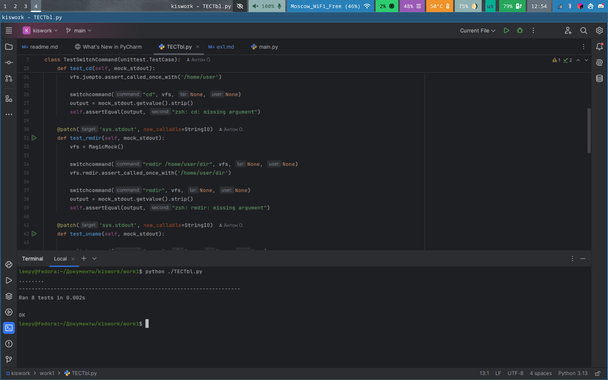
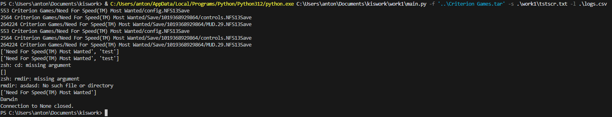
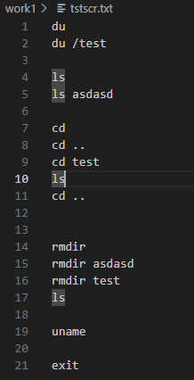
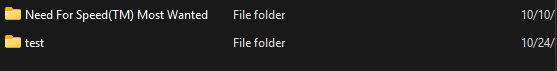

# Задание №1</br>
Разработать эмулятор для языка оболочки ОС. Необходимо сделать работу 
эмулятора как можно более похожей на сеанс shell в UNIX-подобной ОС. 
Эмулятор должен запускаться из реальной командной строки, а файл с 
виртуальной файловой системой не нужно распаковывать у пользователя. 
Эмулятор принимает образ виртуальной файловой системы в виде файла формата 
tar. Эмулятор должен работать в режиме CLI.
Ключами командной строки задаются:

• Имя пользователя для показа в приглашении к вводу.</br>
• Имя компьютера для показа в приглашении к вводу.</br>
• Путь к архиву виртуальной файловой системы.</br>
• Путь к лог-файлу.</br>
• Путь к стартовому скрипту.</br>

Лог-файл имеет формат csv и содержит все действия во время последнего 
сеанса работы с эмулятором. Для каждого действия указаны дата и время. Для 
каждого действия указан пользователь.
Стартовый скрипт служит для начального выполнения заданного списка 
команд из файла.
Необходимо поддержать в эмуляторе команды ls, cd и exit, а также 
следующие команды:
1. du.</br>
2. uname.</br>
3. rmdir.</br>

Все функции эмулятора должны быть покрыты тестами, а для каждой из 
поддерживаемых команд необходимо написать 2 теста.
***
# Описание работы программы</br>
Программа включает в себя несколько файлов интерпритируемого языка python. Для запуска приложения следует открыть файл `main.py` при помощи комманды:
```
python3 main.py
```
Дополнительные библиотеки для работы проекта не требуются. Используются лишь стандартные.
***
# Флаги программы</br>
```
  -u USER,          --user USER                 Имя пользователя
  -v HOST,          --host HOST                 Имя машины
  -f FILESYSTEM,    --filesystem FILESYSTEM     Путь к архиву "файловой системы"
  -l LOGFILE,       --logfile LOGFILE           Путь к логам
  -s SCRIPT,        --script SCRIPT             Стартовый скрипт
```
***
# Описание функций программы</br>
Программа включает в себя четыре файла:
1. `main.py`</br>
2. `VirtFS.py`</br>
3. `logger.py`</br>
4. `argsniffer.py`</br>
### main.py
1. main()
<br>основной алгоритм программы</br>
2. startscript (script - файл скрипта, vfs - виртуальная файловая система, tar - экземпляр архива)
<br>обработчик скрипта запуска</br>
3. switchcommand (command - команда, vfs - виртуальная файловая система, tar - экземпляр архива, user - имя пользователя)
<br>функция выбора команды</br>
### VirtFS.py
Класс для работы с виртуальной файловой системой
1. pushtree (self, file - строка файла, полученного от init_fs)
<br>помещение одного объекта в файловую систему</br>
2. init_fs (self, path - путь до виртуальной файловой системы)
<br>получение файлов и вызов pushtree</br>
3. listdir (self, path - путь(по умолчанию None))
<br>вывод файлов директории</br>
4. jumpto (self, path - путь)
<br>переход на нужную директорию</br>
5. goto (self, path - путь)
<br>вспомогательная функция rmdir и ls, если будет производиться просмотр другой директории</br>
6. du (vfs, tar)
<br>вывод файла и его размера</br>
7. uname ()
<br>вывод названия ядра</br>
8. rmdir (vfs, dir_name)
<br>удаление директории(не рекурсивно)</br>
### logger.py
1. createaction(self, action - команда пользователя)
<br>запись введённой комманды пользователя</br>
### argsniffer.py
1. parse_args()
<br>парсинг аргументов коммандрой строки при запуске скрипта</br>
***
# Тестирование программы</br>
Для тестирования был выбран unittest.



# Старое тестирование</br>
Т.к. в условии задачи есть требование загрузки стартового скрипта, то тесты можно сделать с его помощью

Выход работы стартового скрипта:</br>


Стартовый скрипт:</br>


Структура архива:</br>
