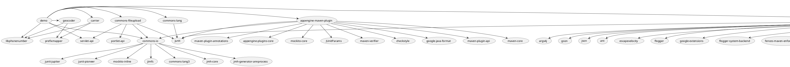
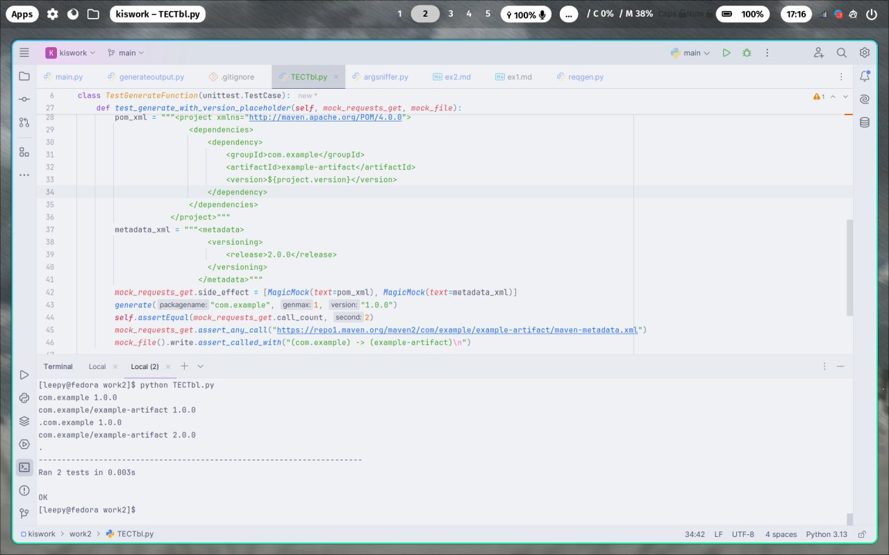

Разработать инструмент командной строки для визуализации графа 
зависимостей, включая транзитивные зависимости. Сторонние средства для 
получения зависимостей использовать нельзя.
<br>Зависимости определяются по имени пакета языка Java (Maven). Для 
описания графа зависимостей используется представление PlantUML. 
<br>Визуализатор должен выводить результат в виде сообщения об успешном 
выполнении и сохранять граф в файле формата png.
Ключами командной строки задаются:
<br>• Путь к программе для визуализации графов. (Флаг отброшен, т.к. используется pythonplantuml)
<br>• Имя анализируемого пакета.
<br>• Путь к файлу с изображением графа зависимостей.
<br>• Максимальная глубина анализа зависимостей.
<br>Все функции визуализатора зависимостей должны быть покрыты тестами.

# Описание раюоты программы
Программа включает в себя несколько файлов интерпритируемого языка python. Для запуска приложения следует открыть файл `main.py` при помощи комманды:
```
python3 main.py
```
Дополнительные библиотеки для работы проекта не требуются. Используются лишь стандартные.
***
# Флаги программы</br>
```
  -l, --library LIBRARY Путь к plantuml
  -p, --package PACKAGE Имя анализируемого пакета
  -f, --file FILE       Путь к файлу с изображением графа зависимостей
  -d, --depth DEPTH     Максимальная глубина анализа зависимостей
```
***
# Описание функций программы</br>
Программа включает в себя четыре файла:
1. `main.py`</br>
2. `generateoutput.py`</br>
3. `reqgen.py`</br>
4. `argsniffer.py`</br>

Все остальные файлы вспомогательные. Главным файлом является `reqgen.py`, реализующий запись в файл, как и парсинг
### reqgen.py
1. generate(packagename, genmax, version = 'latest', generation = 0, outfile = "test")
<br>Парсинг зависимостей и запись их в файл</br>
***
# Демонстрация работы программы:
```
$ python main.py -l plantuml-1.2024.7.jar -p pkg:maven/com.googlecode.libphonenumber/demo -f a.jpg -d 2
com.googlecode.libphonenumber/demo 8.13.50
com.google.template/soy 2022-07-20
com.google.code.findbugs/jsr305 3.0.2
com.google.errorprone/error_prone_annotations 2.14.0
...
```

***
# Тестирование программы:
