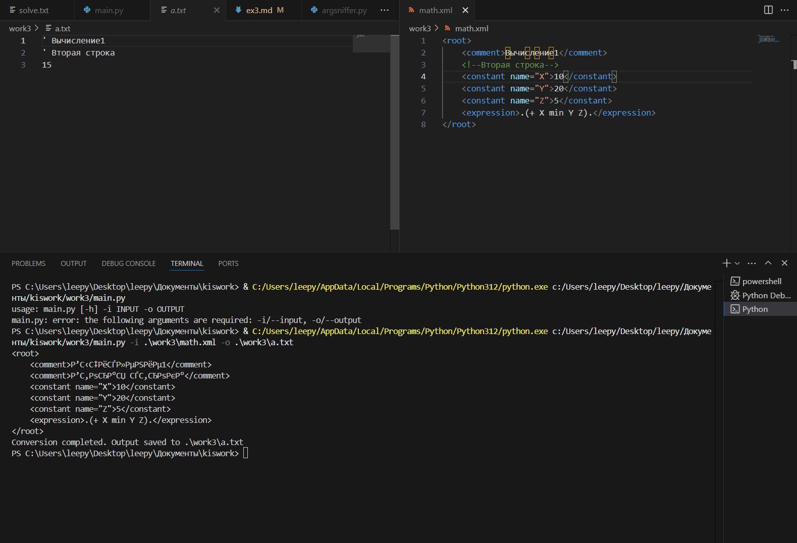
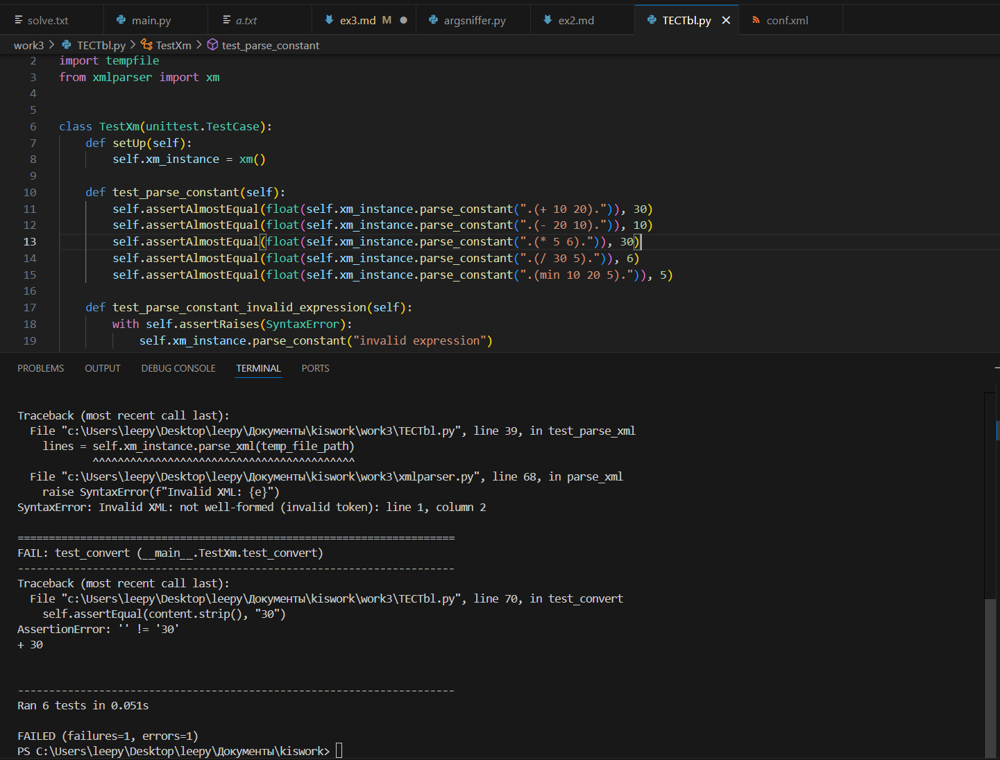

Разработать инструмент командной строки для учебного конфигурационного
языка, синтаксис которого приведен далее. Этот инструмент преобразует текст из
входного формата в выходной. Синтаксические ошибки выявляются с выдачей
сообщений.
<br>Входной текст на языке xml принимается из файла, путь к которому задан
ключом командной строки. Выходной текст на учебном конфигурационном
языке попадает в файл, путь к которому задан ключом командной строки.
<br>Однострочные комментарии:
<br>```' Это однострочный комментарий```
<br>Многострочные комментарии:
```
(*
Это многострочный
комментарий
*)
```
Массивы:
<br>```[ значение значение значение ... ]```
106
<br>Имена:
<br>`[A-Z]+`
<br>Значения:
<br>• Числа.
<br>• Строки.
<br>• Массивы.
<br>Строки:
<br>`"Это строка"`
<br>Объявление константы на этапе трансляции:
<br>`(def имя значение);`
<br>Вычисление константного выражения на этапе трансляции (префиксная
форма), пример:
<br>`.(+ имя 1).`
<br>Результатом вычисления константного выражения является значение.
<br>Для константных вычислений определены операции и функции:
1. Сложение.
2. Вычитание.
3. Умножение.
4. Деление.
5. min().

<br>Все конструкции учебного конфигурационного языка (с учетом их
возможной вложенности) должны быть покрыты тестами. Необходимо показать 3
примера описания конфигураций из разных предметных областей.
# Описание раюоты программы
Программа включает в себя несколько файлов интерпритируемого языка python. Для запуска приложения следует открыть файл `main.py` при помощи комманды:
```
python3 main.py
```
Дополнительные библиотеки для работы проекта не требуются. Используются лишь стандартные.
***
# Флаги программы</br>
```
  -i, --input   FILE    входной файл
  -o, --output  FILE    выходной файл
```
***
# Описание функций программы</br>
Программа включает в себя три файла:
1. `main.py`</br>
2. `xmlparser`</br>
3. `argsniffer.py`</br>

Все остальные файлы вспомогательные. Главным файлом является `xmlparser`, реализующий запись в файл, как и парсинг
### xmlparser
1. parse_constant(self, expr)
<br>Парсинг выражения</br>
2. _parse_constant(self, expr)
<br>Вспомогательная функция. Рекурсивно вычесляет пример</br>
4._resolve_constant(self, value)
<br>Сопоставление константы с числом в словаре</br>
5.parse_xml(self, xml_file)
<br>Получение xml файла и его последующее форматирование</br>
6._convert_element(self, element)
<br>Парсинг строк xml файла</br>
7.convert(self, xml_file, output_file)
<br>Запись в файл</br>
***
# Демонстрация работы программы:

***
# Тестирование программы:
